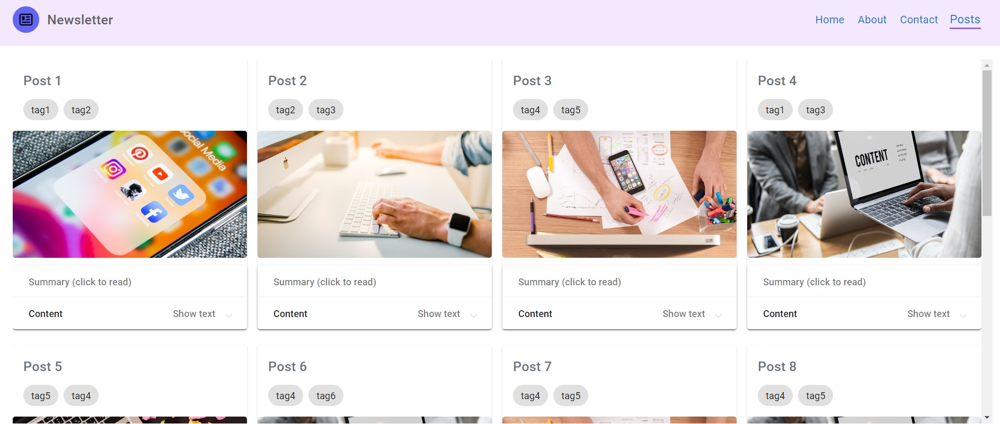

# NewsletterServiceFe

   

This is simple newsletter service, generated with Angular 17.3.7. You can see four first posts on main page, search posts by a tag name or select tags from dropdown menu.

## Main page

You can type tag name in searchbar and after click on button, only posts including this tag will be shown. If you clear search field and click button again, you'll see default four posts.

You can select a tag name from dropdown menu and only posts including selected option will be shown. After click on "All" option, default four posts will be shown. The same logic is on tag click on each post card.

## Post card

Each post card on Home or Posts page is clickable. You can click on tag buttons to render posts by tag. If you click on Summary or Content, you'll be able to see hidden text.

Also you can click on post's image and open post page. On this page you can see all detailed info and big image. On Goback button click you'll be redirected on previous page.

## Posts page

On posts page renders only list of first 10 posts (potentially, some infinite scroll logic can be added). All post cards are reusable and have the same logic as on main page.

